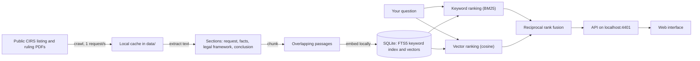

# Lupa Fiscal

**Ask a tax question in plain Portuguese and find the published binding rulings (informações vinculativas) that answer it, with the passage, the citation and a link to the official PDF.**

[](https://github.com/nunomarques97/lupa-fiscal/actions/workflows/ci.yml?query=branch%3Amain) · [MIT licence](LICENSE) · .NET 10 · Runs only on your computer · No account, no key, no cost

> **Independent project.** Lupa Fiscal is not affiliated with, endorsed by or connected to the Autoridade Tributária e Aduaneira or any other public body. It only reads rulings that are already public.
>
> **Not tax advice.** Results are excerpts to help you find the right ruling. Always read the official ruling in full, and ask a qualified professional about your own situation.


- **Never invents an answer.** Every result is a passage quoted from a published ruling, with its process number, article and date, and a link to the PDF on the official site.
- **Free and open source.** MIT licence. No account, API key or paid service.
- **Local.** The search runs on your own computer. Your questions are never sent anywhere.
- **Measured.** On a fixed set of 50 everyday questions, a matching ruling is in the first 10 results for 45 of them ([report](docs/eval/report.md)).

Version 0.1 covers the rulings on personal income tax (CIRS): 1189 rulings, as listed on 2 October 2026.

## Em português

O Lupa Fiscal é uma ferramenta gratuita e de código aberto para pesquisar as informações vinculativas publicadas pela Autoridade Tributária e Aduaneira. Basta escrever a pergunta em linguagem corrente para obter as informações vinculativas mais próximas, com a passagem relevante, o número do processo, o artigo, a data e a ligação para o PDF oficial. A ferramenta nunca redige respostas próprias: mostra apenas excertos de informações vinculativas publicadas, sempre com a fonte. A versão 0.1 abrange o Código do IRS e funciona inteiramente no seu computador, sem conta nem custos. Não constitui aconselhamento fiscal nem tem qualquer ligação à Autoridade Tributária e Aduaneira: leia sempre a informação vinculativa oficial. As instruções de instalação, abaixo, estão em inglês.

## Screens

<p>
  
  
  
</p>

The interface is in European Portuguese and works on desktop and phone. Every screen state (first visit, loading, results, filters, no results, error, validation) at 1440 and 390 px wide is in [docs/evidence/](docs/evidence/).

## Quick start

You need Windows 10 or 11, the [.NET SDK 10](https://dotnet.microsoft.com/download), [Node.js](https://nodejs.org/) 22 or 24, an internet connection for the first setup and about 1 GB of free disk space for the data, plus room for the .NET and npm packages.

```
git clone https://github.com/nunomarques97/lupa-fiscal.git
cd lupa-fiscal
dotnet run --project src/LupaFiscal.Cli -- crawl --tax CIRS
dotnet run --project src/LupaFiscal.Cli -- index
npm --prefix web ci
npm --prefix web run build
dotnet run --project src/LupaFiscal.Api
```

Then open http://localhost:4401 and ask a question.

What to expect:

- `crawl` downloads the 1189 CIRS rulings at one request per second, so it takes about 20 to 25 minutes. You can stop it at any time; running it again resumes where it stopped.
- `index` first downloads the embedding model (about 470 MB, checked against its SHA-256), then indexes the rulings in about 5 minutes on a CPU.
- The API loads the model and the index in about 2 seconds; after that, each search takes a few tens of milliseconds.

The rulings are downloaded once and kept on your computer, in `data/`.

## Commands in detail

Run every command from the repository root. Data goes to `data/` (never committed); use `--data-dir PATH` or the `LUPAFISCAL_DATA_DIR` environment variable to put it elsewhere. `dotnet run --project src/LupaFiscal.Cli -- help` lists every command and option.

**Build and test** (offline, on a small synthetic corpus):

```
dotnet build LupaFiscal.slnx
dotnet test LupaFiscal.slnx
```

**1. Download the CIRS rulings** and check that none is left pending:

```
dotnet run --project src/LupaFiscal.Cli -- crawl --tax CIRS
dotnet run --project src/LupaFiscal.Cli -- corpus-status --tax CIRS
```

`crawl` options: `--retry-failed`, `--use-cached-listing`, `--interval-seconds N` (at least 1), `--max-retries N`, `--max-downloads N`. `corpus-status` exits 0 only when no listed ruling is pending; add `--list-failed` to see the reasons for failures. Scanned PDFs without a text layer are listed and skipped (no OCR in v0.1; no CIRS ruling needed it).

**2. Download the embedding model** (optional: `index` does it on its first run):

```
dotnet run --project src/LupaFiscal.Cli -- model download
```

**3. Build the index** and check it (running `index` again only processes what changed):

```
dotnet run --project src/LupaFiscal.Cli -- index
dotnet run --project src/LupaFiscal.Cli -- index-status
```

**4. Search from the command line:**

```
dotnet run --project src/LupaFiscal.Cli -- search "Posso deduzir as despesas de educação dos meus filhos no IRS?"
```

Options: `--tax CIRS`, `--article 78-D`, `--year 2024`, `--limit N` (1 to 50, default 10), `--mode hybrid|keyword|vector` (default hybrid).

**5. Run the web interface:**

```
npm --prefix web ci
npm --prefix web run build
dotnet run --project src/LupaFiscal.Api
```

Open http://localhost:4401. The API listens only on this computer (loopback) and also serves the built interface. Its endpoints:

- `GET /api/search?q=...&tax=&article=&year=&limit=` (q required, at most 500 characters; limit 1 to 50, default 10; invalid input returns a 400 problem response)
- `GET /api/facets` (rulings per tax, article and publication year)
- `GET /api/health`

To work on the interface with live reload, keep the API running, run `npm --prefix web start` and open http://localhost:4400.

**Measure retrieval quality and speed** (needs the index):

```
dotnet run --project src/LupaFiscal.Cli -- eval --questions eval/questions.json --out docs/eval/report.md --min-recall 0.70
dotnet run --project src/LupaFiscal.Cli -- bench --questions eval/questions.json --max-ms 1000
```

## How it works



1. A polite crawler reads the public CIRS listing and downloads each ruling PDF once: it reads robots.txt first, makes at most one request per second with a descriptive User-Agent, and keeps everything in a local cache.
2. The text of each PDF is extracted.
3. Each ruling is cleaned of page headers and footers, split into its sections (request, facts, legal framework, conclusion) and then into overlapping passages of at most 512 model tokens.
4. Every passage gets a vector from a multilingual model that runs locally (ONNX Runtime, CPU), and goes into a keyword index (SQLite FTS5).
5. A question is searched both ways: by keywords (BM25) and by meaning (vector similarity). The two rankings are merged with reciprocal rank fusion, keeping the best passage of each ruling.

Design decisions, rejected alternatives and trade-offs: [docs/WALKTHROUGH.md](docs/WALKTHROUGH.md).

## Results on CIRS

| | |
|---|---|
| Rulings indexed | 1189 (all listed CIRS rulings, none skipped) |
| Passages | 5938 |
| Eval set | 50 plain-Portuguese questions over 29 CIRS articles, with 197 expected rulings, frozen before any measurement ([how they were built](eval/README.md)) |

| Search mode | recall@10 | MRR@10 |
|---|---|---|
| Keyword only (BM25) | 0.800 | 0.578 |
| Vector only | 0.860 | 0.613 |
| Hybrid (RRF) | **0.900** | **0.631** |

recall@10 is the share of questions with at least one expected ruling in the first 10 results; MRR@10 rewards finding it near the top. Hybrid search finds a matching ruling for 45 of the 50 questions; the 5 misses are listed in the report.

Latency of hybrid search over the 50 questions, including the question's embedding, on a CPU: **32 ms** median (p50), **40 ms** p95, **53 ms** maximum.

Full report and method: [docs/eval/report.md](docs/eval/report.md).

## FAQ

**Why does it not write answers?**
A generated answer can sound right and still be wrong. In v0.1 every result is a passage quoted from a published ruling, with the source one click away, so nothing is invented and you can always check the original.

**Why local?**
No server, account or paid service is needed, and your questions stay on your computer. The network is used only to download the rulings from the official site and the model from Hugging Face; searching never leaves your machine.

**Why hybrid search?**
Keyword search is good at exact legal terms and article numbers; vector search is good at everyday wording. Combined, they find more than either alone (recall@10 0.900 against 0.800 and 0.860).

**Which taxes are covered?**
Version 0.1 covers the rulings listed under CIRS (personal income tax). Some of them concern another law, such as the Estatuto dos Benefícios Fiscais or a State Budget law. Every tax is planned for v0.2.

**Is it tax advice?**
No. It helps you find relevant rulings. A ruling answers the specific situation it was asked about; read it in full and ask a qualified professional about your own case.

## About the rulings

The rulings are published by the Autoridade Tributária e Aduaneira on [info.portaldasfinancas.gov.pt](https://info.portaldasfinancas.gov.pt/). The site's terms allow reproduction for non-commercial purposes with the source cited, and every result names its ruling and links to its official PDF. The site also states that only the version published in Diário da República is authentic. Details: [docs/research/gate0.md](docs/research/gate0.md).

This repository contains no ruling PDFs and no corpus: each user downloads the rulings to their own computer. The only ruling content in it is a few passages and subject lines shown, with their source, in the screenshots and the design mocks (`docs/ui/`), a few listing entries quoted in the tests and the research notes, and the ruling identifiers of the eval set.

## Embedding model

[intfloat/multilingual-e5-small](https://huggingface.co/intfloat/multilingual-e5-small), MIT licence, pinned at revision `614241f622f53c4eeff9890bdc4f31cfecc418b3`. The files used are `onnx/model.onnx` (fp32), `onnx/sentencepiece.bpe.model` and `onnx/tokenizer.json`, downloaded from Hugging Face without an account and verified by SHA-256 before every use. The model is not stored in this repository.

## Third-party licences

| Component | Use | Licence |
|---|---|---|
| [multilingual-e5-small](https://huggingface.co/intfloat/multilingual-e5-small) | Embedding model | [MIT](https://huggingface.co/intfloat/multilingual-e5-small/blob/main/README.md) |
| [PdfPig](https://github.com/UglyToad/PdfPig) | PDF text extraction | [Apache-2.0](https://github.com/UglyToad/PdfPig/blob/master/LICENSE) |
| [ONNX Runtime](https://github.com/microsoft/onnxruntime) | Running the model | [MIT](https://github.com/microsoft/onnxruntime/blob/main/LICENSE) |
| [Microsoft.ML.Tokenizers](https://github.com/dotnet/machinelearning) | Model tokeniser | [MIT](https://github.com/dotnet/machinelearning/blob/main/LICENSE) |
| [Microsoft.Data.Sqlite](https://github.com/dotnet/efcore) and [SQLite](https://sqlite.org/) | Index storage and keyword search | [MIT](https://github.com/dotnet/efcore/blob/main/LICENSE.txt), [public domain](https://sqlite.org/copyright.html) |
| [Angular](https://github.com/angular/angular) | Web interface | [MIT](https://github.com/angular/angular/blob/main/LICENSE) |
| [Playwright](https://github.com/microsoft/playwright) | Screenshots (development only) | [Apache-2.0](https://github.com/microsoft/playwright/blob/main/LICENSE) |

The interface uses the fonts already installed on your system; no font files are bundled or downloaded.

## Roadmap

- v0.1 (this version): CIRS rulings, local search, no generated answers.
- v0.2: every tax, plus answers written only from cited rulings, each statement linked to its source.
- v1: public hosting.

## Contributing

Issues and pull requests are welcome. See [CONTRIBUTING.md](CONTRIBUTING.md) for setup, tests, the polite-crawling rules and the evidence a change needs.

## Licence

[MIT](LICENSE). The licence covers the code in this repository, not the rulings or the model.
