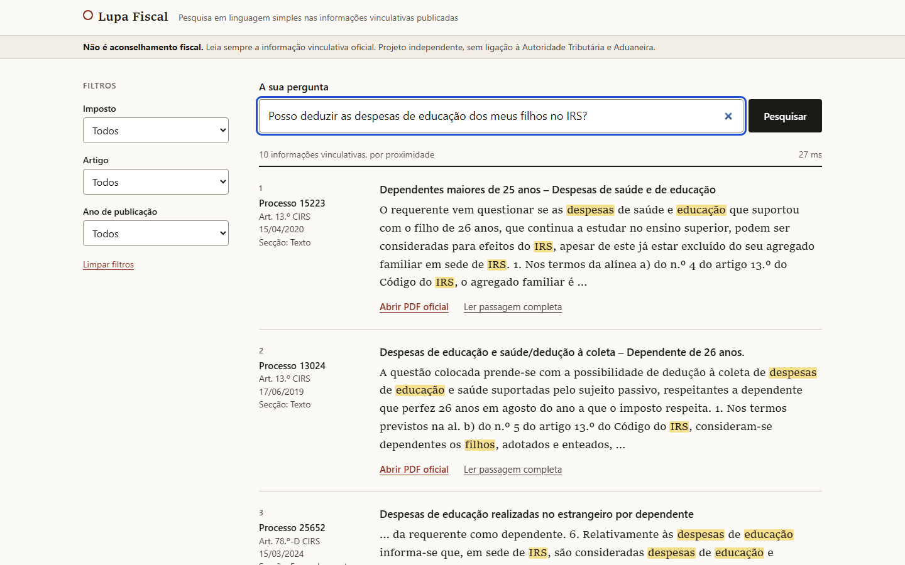
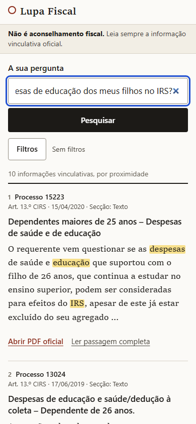
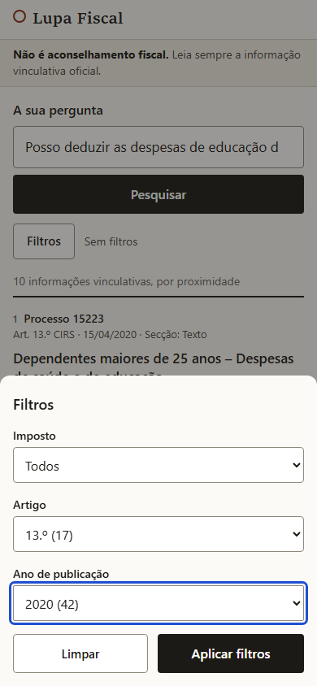
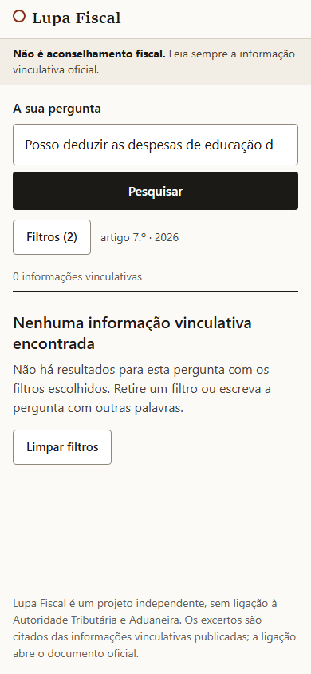

# Lupa Fiscal

Search the public binding rulings (informações vinculativas) of the Portuguese tax authority by asking a question in plain Portuguese. Lupa Fiscal returns the closest rulings with the passage that matters, its citation (process number, article, date) and a link to the official PDF.

It never writes an answer of its own: every result is a passage quoted from a published ruling, so there is nothing to invent. Version 0.1 covers the rulings on personal income tax (CIRS) and runs entirely on your own computer.

> **Independent project.** Lupa Fiscal is not affiliated with, endorsed by or connected to the Autoridade Tributária e Aduaneira or any public body. It only reads rulings that are already public.
>
> **Not tax advice.** Results are excerpts to help you find the right ruling. Always read the official ruling in full, and ask a qualified professional about your own situation.



<p>
  
  
  
</p>

More screens (first visit, loading, filters, no results, error, validation) at 1440 and 390 px are in [docs/evidence/](docs/evidence/).

## How it works

1. A polite crawler reads the public CIRS listing, downloads each ruling PDF once (at most one request per second, with a descriptive User-Agent) and keeps everything in a local cache.
2. The text of each PDF is extracted. Scanned PDFs without a text layer are listed and skipped (no OCR in v0.1).
3. Each ruling is split into sections (request, facts, legal framework, conclusion) and then into overlapping passages.
4. Every passage gets a vector from a multilingual model that runs locally, and goes into a keyword index (SQLite FTS5).
5. A question is searched both ways: by keywords (BM25) and by meaning (vector similarity). The two rankings are merged with reciprocal rank fusion.

No external service is called at search time, and nothing leaves your computer.

## Results on CIRS

| | |
|---|---|
| Rulings indexed | 1189 (all listed CIRS rulings, none skipped) |
| Passages | 5938 |
| Eval set | 50 plain-Portuguese questions with their expected rulings ([how they were built](eval/README.md)) |

| Search mode | recall@10 | MRR@10 |
|---|---|---|
| Keyword only (BM25) | 0.800 | 0.578 |
| Vector only | 0.860 | 0.613 |
| Hybrid | **0.900** | **0.631** |

Hybrid search takes 32 ms (median) and 53 ms at worst over the 50 questions on a desktop CPU, including the question's embedding. Full report: [docs/eval/report.md](docs/eval/report.md).

## Requirements

- Windows 10 or 11 (the code is plain .NET and Node, but only Windows is tested)
- [.NET SDK 10](https://dotnet.microsoft.com/download)
- [Node.js](https://nodejs.org/) 22 or 24, for the web interface
- About 1 GB of free disk space (500 MB model, 100 MB of PDFs, 40 MB index)

No account, key or paid service is needed.

## Build and run

Run every command from the repository root. Data goes to `data/` (never committed); use `--data-dir` or the `LUPAFISCAL_DATA_DIR` variable to put it elsewhere.

```
git clone https://github.com/nunomarques97/lupa-fiscal.git
cd lupa-fiscal
dotnet build LupaFiscal.slnx
dotnet test LupaFiscal.slnx
```

**1. Download the CIRS rulings** (about 25 minutes; stop it at any time and run it again to resume):

```
dotnet run --project src/LupaFiscal.Cli -- crawl --tax CIRS
dotnet run --project src/LupaFiscal.Cli -- corpus-status --tax CIRS
```

**2. Download the embedding model** (about 470 MB, checked against its SHA-256; `index` also does this on first run):

```
dotnet run --project src/LupaFiscal.Cli -- model download
```

**3. Build the index** (about 5 minutes on a CPU; running it again only processes what changed):

```
dotnet run --project src/LupaFiscal.Cli -- index
dotnet run --project src/LupaFiscal.Cli -- index-status
```

**4. Search from the command line:**

```
dotnet run --project src/LupaFiscal.Cli -- search "Posso deduzir as despesas de educação dos meus filhos no IRS?"
```

Options: `--article 78-D`, `--year 2024`, `--limit 20`, `--mode keyword|vector|hybrid`.

**5. Start the web interface:**

```
npm --prefix web ci
npm --prefix web run build
dotnet run --project src/LupaFiscal.Api
```

Open http://localhost:4401. The API only listens on this computer. It also answers `GET /api/search?q=...&tax=&article=&year=&limit=`, `GET /api/facets` and `GET /api/health`.

To work on the interface with live reload, keep the API running and start `npm --prefix web start`, then open http://localhost:4400.

**Measure retrieval quality and speed** (needs the index):

```
dotnet run --project src/LupaFiscal.Cli -- eval --questions eval/questions.json --out docs/eval/report.md --min-recall 0.70
dotnet run --project src/LupaFiscal.Cli -- bench --questions eval/questions.json --max-ms 1000
```

How it is put together, and why: [docs/WALKTHROUGH.md](docs/WALKTHROUGH.md).

## About the rulings

The rulings are published by the Autoridade Tributária e Aduaneira on [info.portaldasfinancas.gov.pt](https://info.portaldasfinancas.gov.pt/). This repository contains no ruling text or PDF: each user downloads them to their own computer. The site's terms allow reproduction for non-commercial purposes with the source cited, and every result links to its official PDF. Only the version published in Diário da República is authentic. Details: [docs/research/gate0.md](docs/research/gate0.md).

## Embedding model

[intfloat/multilingual-e5-small](https://huggingface.co/intfloat/multilingual-e5-small), MIT licence, pinned at revision `614241f622f53c4eeff9890bdc4f31cfecc418b3`. The files used are `onnx/model.onnx` (fp32), `onnx/sentencepiece.bpe.model` and `onnx/tokenizer.json`, downloaded from Hugging Face without an account and verified by SHA-256 before every use. The model is not stored in this repository.

## Third-party licences

| Component | Use | Licence |
|---|---|---|
| [multilingual-e5-small](https://huggingface.co/intfloat/multilingual-e5-small) | Embedding model | [MIT](https://huggingface.co/intfloat/multilingual-e5-small/blob/main/README.md) |
| [PdfPig](https://github.com/UglyToad/PdfPig) | PDF text extraction | [Apache-2.0](https://github.com/UglyToad/PdfPig/blob/master/LICENSE) |
| [ONNX Runtime](https://github.com/microsoft/onnxruntime) | Running the model | [MIT](https://github.com/microsoft/onnxruntime/blob/main/LICENSE) |
| [Microsoft.ML.Tokenizers](https://github.com/dotnet/machinelearning) | Model tokeniser | [MIT](https://github.com/dotnet/machinelearning/blob/main/LICENSE) |
| [Microsoft.Data.Sqlite](https://github.com/dotnet/efcore) and [SQLite](https://sqlite.org/) | Index storage and keyword search | [MIT](https://github.com/dotnet/efcore/blob/main/LICENSE.txt), [public domain](https://sqlite.org/copyright.html) |
| [Angular](https://github.com/angular/angular) | Web interface | [MIT](https://github.com/angular/angular/blob/main/LICENSE) |
| [Playwright](https://github.com/microsoft/playwright) | Screenshots (development only) | [Apache-2.0](https://github.com/microsoft/playwright/blob/main/LICENSE) |

The interface uses the fonts already installed on your system; no font files are bundled or downloaded.

## Roadmap

- v0.1 (this version): CIRS rulings, local search, no generated answers.
- v0.2: every tax, plus answers written only from cited rulings, each statement linked to its source.
- v1: public hosting.

## Contributing

See [CONTRIBUTING.md](CONTRIBUTING.md).

## Licence

[MIT](LICENSE). The licence covers the code in this repository, not the rulings or the model.
